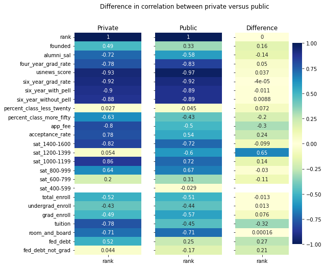
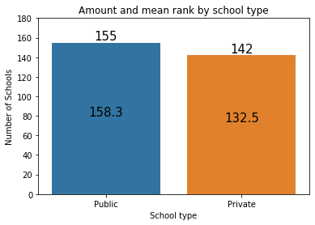
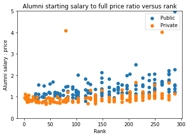
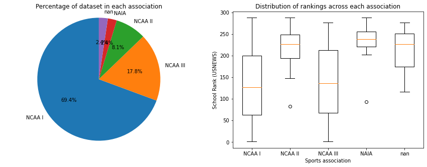

# USNEWS Exploratory Data Analysis
## Goal
To analyize and present observations and trends I found interesting while exploring the [USNEWS](https://www.usnews.com/best-colleges/rankings/national-universities) college rankings dataset.

## About the Data
I scraped the data for this project from the USNEWS website. If you would like to scrape recent data, see a more indepth description of the data, or download the dataset used in this EDA, see that repository [here](https://github.com/BaileyDalton007/USNEWS_College_Webscraping).

## Figures
If you would like to have a closer look at the code or run it yourself, see `data_analysis.ipynb`.

### USNEWS Score and Rank
Considering that USNEWS [claims](https://www.usnews.com/education/best-colleges/articles/how-us-news-calculated-the-rankings) that the rankings are based off of each school's score, we can assume that the two features should be highly correlated. I decided to test it by plotting them against each other and got an interesting result.

The figure shows a very direct correlation, but with a few outliers. After some investigation I saw that the webscraper was misreporting ranks for six or so schools, so I manually fixed that in the dataset. 

Here were the outliers:
DePaul University, University of St. Thomas (MN), University of the Incarnate Word, 
Colorado School of Mines, University of Idaho, University of Memphis

It seems that sometimes on the school's info page that USNEWS likes to put a ranking from a random category in the place where overall ranking
usually is, which trips up the webscaper time to time.

And here is the correct plot, indeed what we expected.

### Correlation Heatmaps

A full correlation heatmap showing how all the quantitative varibles affect
one another. We are using a symmetrical colormap so that the
variables with the biggest effect are darker regardless of direction

    
This one is a bit large and hard to understand, so this second heatmap just shows the correlation between each feature and rank.

    
This one is similar to the last one, but splits the data into two subsets based on whether a school is public or private.

I used these heatmaps as a roadmap for the rest of this analysis, investigating both the suprisingly high correlations, and the suprisingly low.

#### Observations
Of course now that those outliers from the last figure are fixed, usnews_score has a high negative correlation with rank. I do think it is interesting how the year that a school was founded doesn't correlate with rank more, as when you think of top schools-one may often think of the Ivy League, which is composed of some of the oldest schools in the nation (Harvard being the oldest in the US). I also find the difference in correlation for tutition along with acceptance rate between public and private to be interesting.

### Ranking Distrubitions
USNEWS does not just rank all 300 or so schools sequentially, it is full of ties for certain ranks. To better understand the distribution of these ranks, I plotted them. 

    

    
#### Observations
It seems that the schools toward the beginning are much more spread out and more finely sorted and the farther you go down the ranks, the more clumped together they become. This makes sense as people often care about the exact rankings of the very best, but very few will care the difference in a rank or two in the 200+ range.

### Public vs. Private Schools
In this section we will be comparing public and private schools and how their type affects their ranking. 

    
Here we can see that the amount and average rank of public vs. private schools are near equal with private having a few less school and just a bit better of an average ranking.

    
This plot shows a very interesting trend in pricing of a school versus its rank. We can see two very clear trends that seperates public and private schools. We can see that tutition of private schools is almost always higher, and it decreases with rank in contrast to public's fairly constant line. This explains the difference in correlation of tutition we saw on the heatmap between public and private.

I grouped these four plots together as they show fairly obvious trends that are not all that interesting on their own, but still worth including.

    
For the first graph, we can see that average alumni salary increases with the higher ranked schools. In the second one, we can see that for the top 100 or so schools that acceptance rate increases as the school becomes lower ranked, afterwards it levels out around 85%. The third graph shows that there are plenty of great schools established relatively recently. It also shows the small group of very elite schools that were founded before the country that they reside in, very interesting. And the last graph looks at SAT score distribution for the highest score range, but we will look at that more in-depth in another section. 

Here we can see the debt for graduates from a private school tend to be slightly higher for private schools, which is likely due to the higher tuition. And we can see that debt for non-graduates seems to not correlate with whether the school is public or private.

Here we are comparing the starting salary to full price ratio. This represents the "payoffability" of a school.
    

We can see a trend that private schools are slightly harder to pay off, which makes sense due to their higher tuition. That first outlier is Brigham Young University--Provo with a tuition of $6,120.

### Categorical Variables
Here we are looking at pie charts and box plots showing the distributions of collegiate sports associations and location types.

    

#### Observations
Not a whole lot suprising here. It is interesting how NCAA II and NAIA are concentrated heavily toward the end of the rankings. The same can be said for rural located schools.

## SAT Score Distributions 
Here we will look at the distirubion of SAT scores for schools based on rank. USNEWS reports scores as a percentage of the student body that scored within that range. For example if sat_1200-1399 is 60 for a specific university, that means that 60% of the students at that school (that reported a score) scored between a 1200 and a 1399. Scores lower than 800 for these visualizations were dropped as they were all almost zero.

Here we can see the plots and regressions for each range on the left edge, then all of them color coded and combined on the main plot.

A very fun graph to look at, but not a whole lot suprising here. A score above 1400 matters a lot for the top 50 universities of so, but after that a 1000 or higher seems to do just fine.

Here the universities are seperated into buckets (10 in this case) and the average distribution is calculated for each bucket. 

    
Here as well we can see the importants of a >1400 decreasing and the concentration of 1000-1199 and 1200-1399 scores increasing. It can also be noted that some of the later buckets do not go up to 100% because of those <800 scores that were dropped earlier.
    

### Enrollment Numbers

Here we can see enrollment numbers based on rank of both undergraduate and graduate students. 

#### Observations
It is clear that size of the school does not really affect rank. We can see that there are considerably less graduate students at most schools than there are undergraduate students
    

